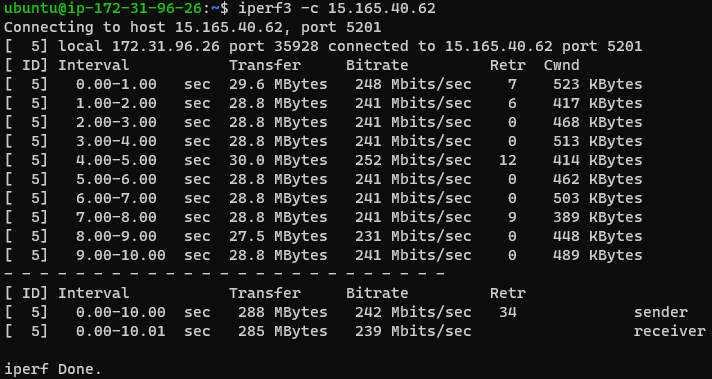
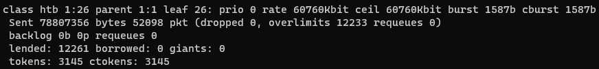

# Performance Analysis

We were carrying out a capstone project for graduation of Computer Science. There were several evaluation criteria, and **performance analysis and its enhancement** were two of them.  
Because of the nature of our service (Collaborative Web-based IDE), we had judged that the response time of it is important. So we planned to conduct a performance test on the [IDE-server](https://github.com/Together-Coding/IDE-server) about response delay.  
I especially tried hard to create an interference-free test environment as mush as possible.

## Performance Goals

### Background

[Speedtest.net](https://speedtest.net) has been reporting [global index rankings](https://www.speedtest.net/global-index) of median network speed and latency. On February, 2022, it was 60.76 Mbps of download, 25.95 Mbps of upload, and 10 ms of latency.
Assuming that our services are used around the world, we though the median speed can be abopted as approximate bitrate of test machines, or at least one test server should be able to withstand that amount of traffic on average.

To set a goal, I measured the delay of the sharing a cursor position on a similar service, [Live Share](https://visualstudio.microsoft.com/ko/services/live-share/), while the median speeds were applied using [throttling](https://developer.chrome.com/blog/new-in-devtools-99/#websocket). It takes about 200 to 300 ms from sending cursor data to other users receiving it on average.

Because there was difficulty in shaping ingress traffic😔, I made a decision to restrict upload speed to 60.76 Mbps and to set latency as 10 ms.

### Our Goals

Our goals are the following with the network conditions applied:  

1. Overall websocket delay:  
    When 50 client scripts send 2 *major* events per second for 5 minutes, we measure the delay time from the departure of each message to the arrival of its corresponding responses.  
    The target figure is 450 ms.
2. Sharing event delay:  
    When they send code modification messages exclusively in the same rate, we measure the delay time in the same way.  
    The target figure is 300 ms.

The *major* events are the importance events that are frequently used in services. They will be randomly chosen by the following probability.

| Event Name | Cursor position | Modify code | Save code | Open file | List file | Add comment | Add question |
|:-----------|----------------:|------------:|----------:|----------:|----------:|------------:|-------------:|
| **Prob**   |           40.0% |       30.0% |     10.0% |     10.0% |      7.0% |        2.5% |         0.5% |

For measuring the second goal, *Modify code* event is sent with 100% probability.

## Traffic Control

In order to construct the environment as interference-free as possible, I prepared the clients to run in AWS Fargate containers.

And then, I was about to use [tc](https://man7.org/linux/man-pages/man8/tc.8.html) to limit bandwidth of the containers. Unfortunately, because Fargate runs on an AWS managed host machine, there is no way to use the `NET_ADMIN` capability or the `privileged` option on a container in order to apply *tc*. As I didn't want to use EC2-based Cluster (because of trade-off between price and the number of network interface), I had to come up with a plausible workaround.

What I'd thought out was:

- To place the containers in a private subnet that has minimal number of IP more than 50 (the number of test clients).
    > 172.31.96.0/27 and 172.31.96.32/27 for 54 IP addresses (excluding AWS reserved IPs).
- To create a NAT instance in each availability zone; two in total.
- To modify the subnets' route table to make the traffic of the containers pass through the NAT.
- To configure NAT instances to use `iptables nat` to do NAT literally.  
- To configure NAT instances to use `iptables mangle` to mark packets by each private IP address.  
- Finally, to create tc *qdisc*s, *class*es and *filter*s to apply traffic shaping by each mark. In result, it applies bitrate and delay on each container.

Configuring NAT, mangle and traffic control can be set by executing `tc.sh`.

### Configuration result

**`iptables` NAT table**  

**`iptables` Mangle table**  

**Bitrate before applying `tc`**  

> `172.31.9.26` is a private IP of EC2 (t2.micro) and `15.165.40.62` is a public IP of IDE-server.

**`tc` qdisc**  

**`tc` class**  

**`tc` filter**  

Using `$ tc -s class dev eth0`, you can check whether the traffic is filtered by tc or not.

This is the output of that command before sending packets from `172.31.96.26` to IDE-server. You can see the class name is `1:26` corresponding to the private IP address.

After sending packets using `iperf3`, the **Sent bytes** is increased, which means, *tc* has worked to pick out packets by their source IP.

**Bitrate after applying `tc`**  

As intended, it has about 60.76 Mbps of bitrate.

## Architecture

As a result, the architecture was constructed like this:

| Server       | Type              | vCPU |  Memory | IOPS |  Bandwidth | Latency |
|:-------------|-------------------|-----:|--------:|-----:|-----------:|--------:|
| NAT instance | AWS EC2 t3.medium | 2.00 |   4 Gib |   60 |  5.00 Gbps |         |
| IDE-server   | AWS EC2 t3.micro  | 2.00 | 1.0 Gib |  100 |  5.00 Gbps |         |
| Test Machine | AWS Fargate       | 0.25 | 0.5 Gib |   60 | 60.76 Mbps |   10 ms |

> One NAT instance processes the traffics from 25 containers. It is at most 60.76 Mbps * 25 = 1,519 Mbps.

Each tester script connects with the IDE-server, sends and receives messages to/from the server. Test conditions are mentioned on [our goal](#our-goals).

## What it does

I decided to use [K6](https://k6.io/) to record metrics during tests. It is one of the test frameworks that can be used as a script (especially Javascript), provide a built-in websocket connection, and are easy to use.

The following stages are executed in the [test-life-cycle](https://k6.io/docs/using-k6/test-life-cycle/) of K6, and are processed sequentially in each Fargate container.

### Setup stage

1. It parses *TaskARN* of itself from [ECS metadata endpoint](https://docs.aws.amazon.com/AmazonECS/latest/userguide/task-metadata-endpoint-v4-fargate.html).
2. Sending the *TaskARN* to [IDE-server](https://github.com/Together-Coding/IDE-Server), it notifies its ready state to the server, and receives test settings from it.
3. Sending its user data allocated by IDE-server to [API-server](https://github.com/Together-Coding/API-Server), it receives JWT for later authentication.

### Virtual User stage

I implemented mock event emitters and handlers that imitate the behavior of users on IDE. The emitters inject a timestamp to specify when the message is sent.

1. First of all, it connects websocket with IDE-server, and sends fundamental events to create its project.
2. It periodically requests the status of the test to synchronize the beginning and the end of the test.
3. When the test is started, it sends two messages chosen by the [probability](#our-goals) per second.
4. When receiving a message,  
    - The delay is recorded using the difference between the time it receives the message and the time the message is sent by (another) user.
    - Also it accumulates the number of each event.
    - For further processing, it pushes the message itself to an array variable.

### End of test

- `notifyEnd` function compresses the accumulated and recorded messages and sends the compressed output to IDE-server.
- `handleSummary` function sends the [K6 summary](https://k6.io/docs/results-visualization/end-of-test-summary/) to the server.

If the server receives the file or data, it uploads them to AWS S3.

## Analytics

Downloading the logs and the summary of a specific test from AWS S3, [analytics/main.py](./analytics/main.py) processes the data and extracts several metrics. Furthermore, it averages the delay in units of 1 second and stores them in chronological order to a JSON file to create a graph.

## Result

For the overall performance test (First goal), there were total 119,631 messages of transmissions and reception, and result is like this:

| Server Recv | Server Send |  Average  |  Median  |   P96    |     Max     |
|:-----------:|:-----------:|:---------:|:--------:|:--------:|:-----------:|
|  108.2 #/s  |  290.6 #/s  | 106.08 ms | 25.61 ms | 26.37 ms | 5,308.52 ms |

For the performance test of code-modification (Second goal), there were total 119,788 messages of transmissions and reception, and result is like this:

| Server Recv | Server Send | Average  |  Median  |   P96    |    Max    |
|:-----------:|:-----------:|:--------:|:--------:|:--------:|:---------:|
|  100.0 #/s  |  299.3 #/s  | 30.96 ms | 21.25 ms | 22.28 ms | 733.19 ms |

## Quickstart

- Build docker image:  
    `$ docker build -t performance-test .`
- Run for local test:  
    `$ docker run --rm --add-host=host.docker.internal:host-gateway -i performance-test`

## Deployment

### Prepare AWS resources

1. Create AWS ECR, and modify `push.sh` using the commands provided on the ECR page.
2. Create ECS TaskDefinition and Fargate Cluster.

### NAT instance

The `tc` script needs to be executed in NAT instances in order to limit bandwidth of the containers.

- Configure NAT and apply traffic control  
    `$ . tc.sh`
- If you want to revoke:  
    `$ . tc_clear.sh`

### Deploy the image

1. Configure AWS credentials to deploy the built images to AWS ECR. See [this document](https://docs.aws.amazon.com/cli/latest/userguide/cli-configure-files.html) to configure.
2. Run deployment script  
    `$ . push.sh`

## Reference

- AWS reserved IP addresses : https://docs.aws.amazon.com/vpc/latest/userguide/configure-subnets.html#subnet-sizing
- how to *tc* : https://www.lartc.org/lartc.html
- *tc* manpage : https://man7.org/linux/man-pages/man8/tc.8.html
- *tc* user guide : http://luxik.cdi.cz/~devik/qos/htb/
- *tc* with iptables mangle : https://serverfault.com/questions/1051682/traffic-control-tc-filter-not-working